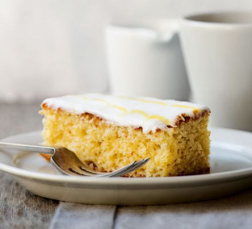

<!-- code here -->
# Lemon Drizzel Slices 
A classic British cake from the Bake Off judge, Paul Hollywood's lemon drizzle is a simple traybake, made extra special with feather icing

## Ingredient
+ for the cake 
  + 70g softened unsalted butter
  + 120g caster sugar
  + 2 medium eggs
  + 140g self-raising flour
  + 1 tsp baking powder
  + finely grated zest 1 lemon
  + 1 tbsp lemon curd
  + 2 tbsp full-fat milk
  
+ for the Drizzel toping 
  + 30g granulated sugar
  + juice 1 lemon

+ For the feather icing
  + 250g icing sugar
  + 10 tbsp water
  + splash of yellow food colouring

  ## Method 

1. Heat oven to 180C/160C fan/ gas 4. Line a 20 x 20cm square baking tin with baking parchment.

2. Using an electric whisk, beat the butter and sugar together until pale, light and fluffy. .Add the eggs and mix again. Add the flour, baking powder, lemon zest, lemon curd and milk, and mix with a wooden spoon until all the ingredients are thoroughly combined. Pour the mixture into the prepared tin and bake for 25-30 mins or until a skewer comes out clean.

3. Mix the sugar  by aware and lemon juice together and pour over the hot cake. Leave to cool in the tin. You can eat the cake as it is, or for a fancy finish, try making this feather icing.

4. Mix the icing sugar with just enough water to give a runny, but not watery, icing. Put a small amount of icing in a separate bowl. Add a few drops of the food colouring to the icing until pale yellow. Spoon into a disposable icing bag.

5. Remove the cake from the tin and peel off the baking parchment. Sit the cake on a wire r
  
> ### recipe from Ahmed , [ahmed magazine]( https://www.bbcgoodfood.com/search/recipes/date/1467327600)

[Paul Hoolywood](https://www.bbcgoodfood.com/chef/paul-hollywood)